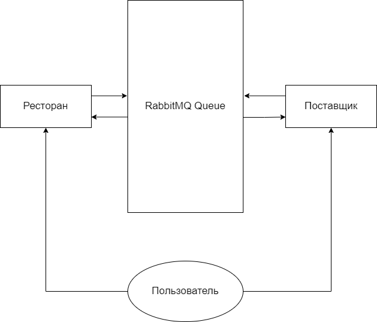

# RTUITLAB (Автоматизация пиццерии)
Проект реализован с требованиями, которые мог бы выдвинуть директор пиццерии для её автоматизации.\
Схема взаимодействия микросервисов в проекте:


Порты, на которых располагаются микросервисы:
* Restaurant (Ресторан) - 8081
* Producer (Производитель) - 8082
* RabbitMQ - 15672 & 5672
* PostgreSQL - 5432
# Стек проекта:
* [Spring Boot](https://spring.io/projects/spring-boot)
* [Unit Tests](https://spring.io/guides/gs/testing-web/)
* [Docker](https://www.docker.com/)
* [RabbitMQ](https://www.rabbitmq.com/)
* [H2](https://www.h2database.com/html/main.html)
* [PostgreSQL](https://www.postgresql.org/)
* [Liquibase](https://liquibase.org/)
* [Swagger](https://swagger.io/)

# Функциональность проекта
Возможности клиента:
1. На микросервисе Restaurant:
  - Управлять должностями в ресторане
  - Управлять сотрудниками и их нагрузкой
  - Управлять складом и блюдами из меню
  - Указывать из каких ингредиентов какое блюдо состоит
2. На микросервисе Producer:
  - Посмотреть список продуктов, который поставщик реализует с рестораном
  - Посмотреть версионность отправок в ресторан
  - Указать сколько поставлять товара, в какое время и в каком количестве

# Микросервисы

Каждый микросервис выполняет определённую роль. Рассмотрим их отдельно.

Каждый сервис поддерживает Swagger для удобной работы.

Каждый микросервис делится на 3 слоя :
- DAL - Data Access Layer
- BLL - Business Logic Layer
- PI - Personal Interface
## Restaurant
> http://localhost:8081/swagger-ui/#/ 

Данный сервис работает в роли ресторана пиццерии, которая имеет автоматизированную часть, а именно:
* Если официант пытается записать блюдо из меню, для которого не хватает ингредиентов на складе, то он сразу получает об этом информацию, вместо того, чтобы идти на кухню и узнавать.
* Во время заказа, когда официант вписывает блюдо, то его ингредиенты "бронируются", то есть другой официант не сможет взять это же блюдо, если первый забронировал "последнее" блюдо.
* Если, во время заказа, клиенты передумали заказывать какое-то блюдо, то ингредиенты для блюда перестают быть "бронированными" и их можно использовать для другого блюда.
* Если удалить какие-то "корневые" данные (официанта, блюдо, заказ и тд.), то дочерние данные тоже удалятся (от официанта удалятся все заказы и ингредиенты вернутся на склад).
* Также, если удалить какие-то "корневые" данные (у которых есть привязка к дочерним, а дочерние без корневых не могут существовать), которые не должны удалять дочерние, то выводится предупреждение. \
Например, если попытаться удалить какой-то ингредиент, который связан с каким-то списком блюд, то блюда не удалятся, так как с логической точки зрения это очень сильно повредит БД, так как могут удалиться огромное количество данных. Поэтому выводится список блюд, где данный ингредиент используется, и, если его из них везде удалить, то все пройдет успешно.
* Каждые несколько секунд ресторан отправляет данные о закончившихся ингредиентах на складе в RabbitMQ, который восполняет их.
* Еще нельзя удалить уже заказанные блюда, так как, если заказано, то ингредиентов для этого хватает и надо делать.
### 1. Структура данных позиций сотрудников

Endpoint: /api/positions

Данный endpoint поддерживает все CRUD команды.

Пример тела запроса. Для delete, post и put запроса надо указывать id в конце endpoint.

```json
{
  "meta": {
    "code": 0,
    "description": "OK"
  },
  "dataBlock": [
    {
      "id": 1,
      "position": "Официант",
      "salary": 0,
      "employees": []
    }
  ]
}
```

### 2. Структура данных сотрудников

Endpoint: /api/employees

Данный endpoint поддерживает все CRUD команды.

Пример тела запроса. Для delete, post и put запроса надо указывать id в конце endpoint.

```json
{
  "meta": {
    "code": 0,
    "description": "OK"
  },
  "dataBlock": [
    {
      "id": 1,
      "name": "Вася",
      "surname": "Пупкин",
      "second_name": "Лентяй",
      "number": "9886343412",
      "position": {
        "id": 1,
        "position": "Официант",
        "salary": 15000
      },
      "orders": []
    }
  ]
}
```

### 3. Структура данных заказов

Endpoint: /api/orders

Данный endpoint поддерживает все CRUD команды.

Пример тела запроса. Для delete, post и put запроса надо указывать id в конце endpoint.

```json
{
  "meta": {
    "code": 0,
    "description": "OK"
  },
  "dataBlock": [
    {
      "id": 1,
      "date_open": "2022-03-18",
      "status": true,
      "date_close": "2022-03-18",
      "dishes": []
    }
  ]
}
```

### 4. Структура данных меню

Endpoint: /api/menu

Данный endpoint поддерживает все CRUD команды.

Пример тела запроса. Для delete, post и put запроса надо указывать id в конце endpoint.

```json
{
  "meta": {
    "code": 0,
    "description": "OK"
  },
  "dataBlock": [
    {
      "id": 1,
      "title": "Пицца пепперони",
      "price": 599,
      "weight": 1000,
      "ingredient": [],
      "unit": {
        "id": 1,
        "unit": "Грамм"
      }
    }
  ]
}
```

### 5. Структура данных размерности

Endpoint: /api/unit

Данный endpoint поддерживает все CRUD команды.

Пример тела запроса. Для delete, post и put запроса надо указывать id в конце endpoint.

```json
{
  "meta": {
    "code": 0,
    "description": "OK"
  },
  "dataBlock": [
    {
      "id": 1,
      "unit": "Грамм"
    },
    {
      "id": 2,
      "unit": "Литр"
    }
  ]
}
```

### 6. Структура данных ингредиентов

Endpoint: /api/ingredient

Данный endpoint поддерживает все CRUD команды.

Пример тела запроса. Для delete, post и put запроса надо указывать id в конце endpoint.

```json
{
  "meta": {
    "code": 0,
    "description": "OK"
  },
  "dataBlock": [
    {
      "id": 1,
      "warehouse": {
        "id": 1,
        "title": "Сыр",
        "weight": 150,
        "amount": 1,
        "price": 200,
        "unit": {
          "id": 1,
          "unit": "Грамм"
        }
      }
    }
  ]
}
```

### 7. Структура данных блюд

Endpoint: /api/dish

Данный endpoint поддерживает все CRUD команды.

Пример тела запроса. Для delete, post и put запроса надо указывать id в конце endpoint.

```json
{
  "meta": {
    "code": 0,
    "description": "OK"
  },
  "dataBlock": [
    {
      "id": 1,
      "menu": {
        ...
        "unit": {
          "id": 1,
          "unit": "string"
        }
      }
    }
  ]
}
```

### 8. Структура данных склада

Endpoint: /api/warehouse

Данный endpoint поддерживает все CRUD команды.

Пример тела запроса. Для delete, post и put запроса надо указывать id в конце endpoint.

```json
{
  "meta": {
    "code": 0,
    "description": "OK"
  },
  "dataBlock": [
    {
      "id": 2,
      "title": "Помидор",
      "weight": 150,
      "amount": 1,
      "price": 15,
      "unit": {
        "id": 1,
        "unit": "Грамм"
      }
    }
  ]
}
```
#### Максимальная выборка из всех таблиц

```json
{
  "meta": {
    "code": 0,
    "description": "OK"
  },
  "dataBlock": [
    {
      "id": 1,
      "name": "Вася",
      "surname": "Пупкин",
      "second_name": "Лентяй",
      "number": "88005553535",
      "position": {
        "id": 1,
        "position": "Официант",
        "salary": 15000
      },
      "orders": [
        {
          "id": 1,
          "date_open": "2022-03-18",
          "status": true,
          "date_close": "2022-03-18",
          "dishes": [
            {
              "id": 1,
              "menu": {
                "id": 1,
                "title": "Пицца с помидорами",
                "price": 599,
                "weight": 1000,
                "ingredient": [
                  {
                    "id": 1,
                    "warehouse": {
                      "id": 1,
                      "title": "Помидоры",
                      "weight": 0,
                      "amount": 0,
                      "price": 0,
                      "unit": {
                        "id": 1,
                        "unit": "Грамм"
                      }
                    }
                  }
                ],
                "unit": {
                  "id": 1,
                  "unit": "Грамм"
                }
              }
            }
          ]
        }
      ]
    }
  ]
}
```
#### Producer 
> http://localhost:8082/swagger-ui/#/

Данный сервис является поставщиком ингредиентов в ресторан. Здесь содержатся 2 таблицы: продукты, которые 
поставляются и версионность, когда, какой и в каком количестве продукт был отправлен.
Детальнее рассмотрим ниже.

### 1. Структура данных склада поставщика

Endpoint: /api/product

Данный endpoint поддерживает все CRUD команды.

Пример тела запроса. Для delete, post и put запроса надо указывать id в конце endpoint.

```json
{
  "meta": {
    "code": 0,
    "description": "OK"
  },
  "dataBlock": [
    {
      "id": 1,
      "title": "string",
      "weight": 0,
      "amount": 6,
      "history": [
        {
          "id": 1,
          "amount": 1,
          "date_delivery": "2022-03-18"
        },
        {
          "id": 2,
          "amount": 1,
          "date_delivery": "2022-03-18"
        },
        {
          "id": 3,
          "amount": 1,
          "date_delivery": "2022-03-18"
        },
        {
          "id": 4,
          "amount": 1,
          "date_delivery": "2022-03-18"
        }
      ]
    }
  ]
}
```

### 2. Структура версионности

Endpoint: /api/history

Данный endpoint поддерживает все CRUD команды.

Пример тела запроса. Для delete, post и put запроса надо указывать id в конце endpoint.

```json
{
  "meta": {
    "code": 0,
    "description": "OK"
  },
  "dataBlock": [
    {
      "id": 1,
      "amount": 1,
      "date_delivery": "2022-03-13"
    },
    {
      "id": 2,
      "amount": 1,
      "date_delivery": "2022-03-13"
    }
  ]
}
```

Данный сервис также получает данные с ресторана, какие ингредиенты закончились. Если такие имеются, то сервис проверяет, 
если у него они и может ли он их поставить. Если поставщик нашел у себя данный 
ингредиент, то он отправляет их на RabbitMQ во вторую очередь для ресторана, а тот их принимает. После поставки данные 
заносятся в версионность.


### Базы данных

В проекте используется 2 вида баз данных:
*  H2 - сугубо для unit тестов
*  PostgreSQL - для основных взаимодействий.
Для поставщика и ресторана выбрана общая база данных для того, что пиццерия понимала, какие продукты она может
   внести к себе (а то окажется, что поставщик не сможет их поставлять, тогда смысла от этих позиций теряется).
 
 ### RabbitMQ
 > занимает порты 15672 и 5672
 > 
 В данном проекте [RabbitMQ](https://www.rabbitmq.com/) используется в связке с AMQP 
 для обработки запросов с
 различных микросервисов. Создается 2 очереди: 
 * для ингредиентов, которые кончились 
 * для тех, которые поставляются.


### Docker

Данный проект поддерживает docker.
Для его запуска достаточно прописать:
```
docker-compose pull
docker-compose up
```

### UnitTests

В проекте используются JUnit с Mockito тестирования для проверки работы: 
* Mapper-ов
* Repository-ев с базой данных H2
* Service-ов

### Liquibase

В проекте также используется liquibase для автоматического создания таблиц в БД и для ведения информации об изменениях.

При запуске на localhost нужно пересобрать проект с зависимостью liquibase, он возьмет готовый скрипт для создания БД.
При запуске на docker необходимо просто скачать образ liquibase и он сам найдет скрипт для БД.

